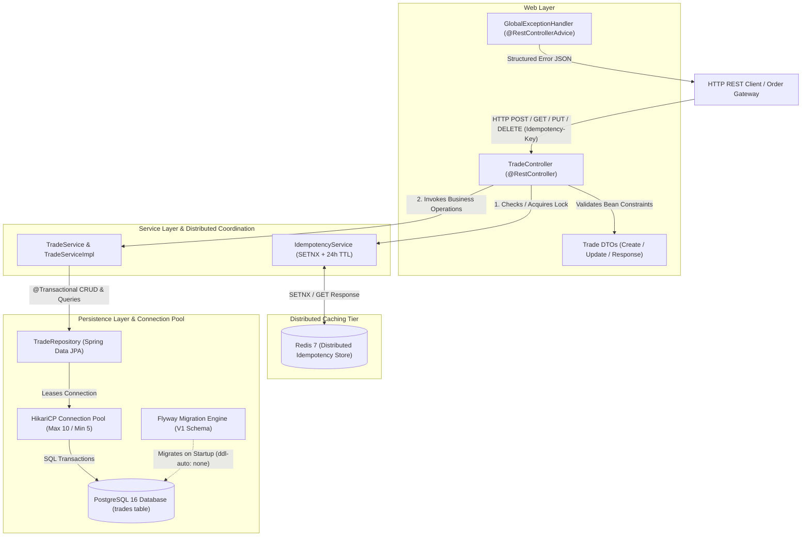

# FinSight — Real-Time Trade Surveillance & Market Abuse Detection Platform

FinSight is a high-performance, real-time trade surveillance and market abuse detection platform inspired by enterprise compliance systems such as **NICE Actimize**. In global financial markets, surveillance engines process high-throughput execution feeds to detect market manipulation patterns—such as wash trading, spoofing, layering, and front-running—under strict regulatory frameworks (SEC Rule 10b-5, FINRA, MiFID II / MAR).

---

## Architecture Overview (Phase 2)

FinSight employs a strictly decoupled, production-grade architecture transitioning from Phase 1's in-memory storage to persistent **PostgreSQL 16** with **HikariCP** connection pooling and distributed request idempotency powered by **Redis 7**:



---

## Phase 2 Engineering Milestones & Architectural Decisions

### 1. Persistent Storage Migration (PostgreSQL 16 & Flyway)
* **Design Decision**: Replaced `InMemoryTradeRepository` (`ConcurrentHashMap` + `AtomicLong`) with a Spring Data JPA `TradeRepository` extending `JpaRepository<Trade, Long>`.
* **Zero Service Layer Disruption**: Because Phase 1 strictly decoupled `TradeService` from `TradeRepository` through interfaces and constructor injection, swapping the persistence engine required zero structural changes to the service business logic.
* **Schema Governance (Flyway as Single Source of Truth)**:
  * Hibernate `ddl-auto` is set to `none`. Hibernate is strictly forbidden from mutating database schemas.
  * Flyway migration `V1__create_trades_table.sql` explicitly creates the `trades` table with `BIGSERIAL` sequence PK, `NUMERIC(18,4)` for monetary accuracy, `TIMESTAMPTZ` for microsecond audit timing, and CHECK constraints on `side`, `status`, `quantity > 0`, and `price > 0`.
* **Surveillance Performance Indexing**:
  * `idx_trades_symbol` on `symbol`: Fast lookup for single-instrument market replay.
  * `idx_trades_trader_id` on `trader_id`: Entity aggregation for trader profiling.
  * `idx_trades_trader_id_created_at` on `(trader_id, created_at)`: Time-series window queries for high-frequency spoofing/layering pattern detection.

### 2. Distributed Request Idempotency with Redis 7
* **Specific Failure Mode Solved**:
  * In institutional trading workflows, network latency or gateway timeouts frequently cause client-side dropouts on `POST /api/v1/trades`.
  * If a client issues a trade and encounters a socket timeout before receiving HTTP 201 Created, the client cannot know if the trade was committed or dropped.
  * Standard automated retry policies would resubmit the request. Without idempotency, a second duplicate trade would be persisted, causing double-execution, incorrect risk allocation, and false-positive compliance violations.
* **Implementation Mechanism**:
  1. Client sends an `Idempotency-Key: <UUID>` header with `POST /api/v1/trades`.
  2. Server uses Redis `SETNX` (`setIfAbsent`) with an atomic 24-hour expiration (`EX 86400`).
  3. If the key already exists: FinSight immediately deserializes and returns the previously cached `TradeResponse` with `200 OK`, bypassing PostgreSQL entirely.
  4. If the key is new: FinSight acquires the token, persists the trade to PostgreSQL, serializes the response into Redis, and returns `201 Created`.
  5. If the database transaction fails, the key is evicted from Redis, allowing immediate safe client retries.

### 3. HikariCP Connection Pool Sizing & Tuning
FinSight explicitly configures HikariCP in `application.yml` rather than relying on unmonitored defaults:
* `maximum-pool-size: 10`: Sized appropriately for a low-latency surveillance microservice to prevent backend connection saturation and context-switching overhead on PostgreSQL.
* `minimum-idle: 5`: Keeps pre-warmed database connections ready to absorb traffic spikes without TCP handshake latency.
* `connection-timeout: 20000` (20s): Maximum thread wait time for connection acquisition before failing fast.
* `idle-timeout: 300000` (5m): Retires idle connections down to minimum-idle.
* `max-lifetime: 1800000` (30m): Prevents stale connections and PostgreSQL backend memory bloat.
* `pool-name: FinSightHikariPool`: Custom name for clear observability in JMX, metrics, and thread dumps.

### 4. Hermetic Integration Testing with Testcontainers
Integration tests (`TradeIntegrationTest`) run against real containerized **PostgreSQL 16** and **Redis 7** instances rather than mocks or H2 in-memory substitutes:
* **Full CRUD Lifecycle**: Verifies schema constraints, auto-audit timestamps (`@PrePersist`/`@PreUpdate`), and REST status transitions.
* **Idempotency Verification**: Validates that repeated POST submissions with the same `Idempotency-Key` return identical trade responses while maintaining exactly 1 row in the PostgreSQL database.
* **Surveillance Queries**: Validates index-accelerated querying by `symbol` and `trader_id`.
* **50-Thread Concurrent Ingestion**: Proves that multi-threaded concurrent trade submissions against PostgreSQL's `BIGSERIAL` sequence produce strictly unique, collision-free IDs across leased HikariCP connections.

---

## REST API Specification

| HTTP Method | Endpoint | Headers / Params | Description | Success Code | Error Codes |
|---|---|---|---|---|---|
| `POST` | `/api/v1/trades` | `Idempotency-Key` (Optional) | Ingest trade (Redis cached on retry) | `201 Created` / `200 OK` | `400 Bad Request`, `409 Conflict` |
| `GET` | `/api/v1/trades/{id}` | — | Retrieve trade by ID | `200 OK` | `404 Not Found` |
| `GET` | `/api/v1/trades` | `symbol`, `traderId` (Optional) | List trades with optional filters | `200 OK` | — |
| `GET` | `/api/v1/trades/trader/{traderId}` | — | Surveillance query by trader ID | `200 OK` | — |
| `GET` | `/api/v1/trades/symbol/{symbol}` | — | Surveillance query by symbol | `200 OK` | — |
| `PUT` | `/api/v1/trades/{id}` | — | Update an existing trade record | `200 OK` | `400 Bad Request`, `404 Not Found` |
| `PATCH` | `/api/v1/trades/{id}/status` | `status` (Query Param) | Update trade lifecycle status | `200 OK` | `404 Not Found` |
| `DELETE` | `/api/v1/trades/{id}` | — | Delete trade record | `204 No Content` | `404 Not Found` |

---

## Local Development & Infrastructure Setup

### 1. Start PostgreSQL & Redis via Docker Compose

```bash
docker-compose up -d
```

### 2. Verify Database Migration & Start Application

Flyway automatically applies `src/main/resources/db/migration/V1__create_trades_table.sql` on startup.

```bash
# Run application
mvn spring-boot:run
```

---

## Multi-Phase Roadmap

* **Phase 1 (Complete)**: Layered architecture, lock-free in-memory storage (`ConcurrentHashMap` + `AtomicLong`), Bean Validation, and global exception handling.
* **Phase 2 (Current)**: PostgreSQL 16 persistence, Flyway migrations, Redis 7 distributed idempotency (SETNX), HikariCP pool tuning, and Testcontainers integration testing.
* **Phase 3 (Upcoming)**: Kafka streaming ingestion, real-time market abuse pattern detection engine (wash trading, spoofing rules), and WebSocket compliance alert streams.
